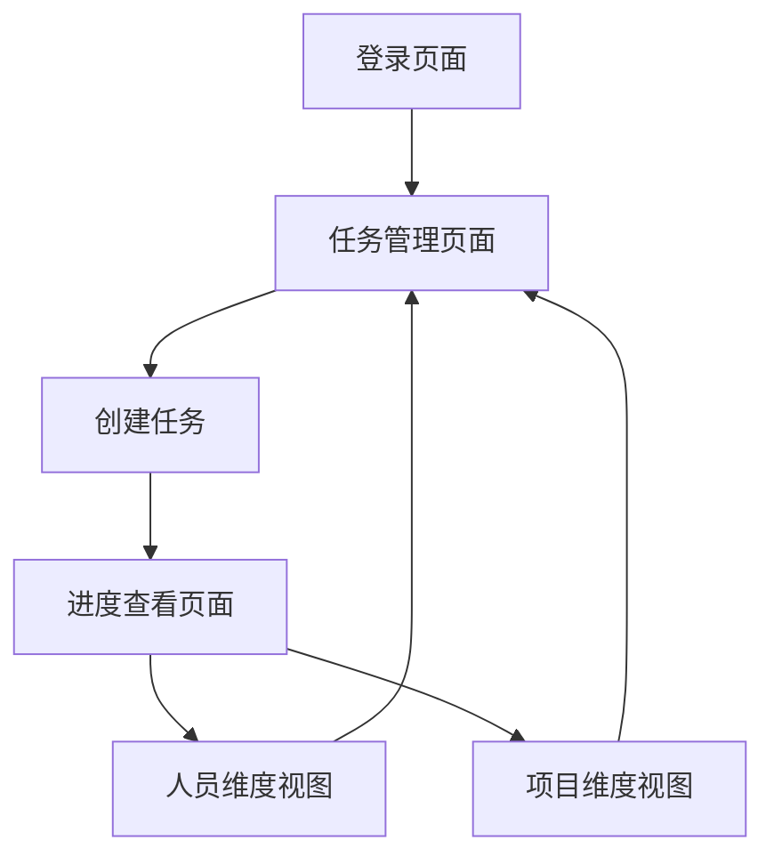

## 1. 产品概述
一个专为团队管理者设计的任务进度监督工具，帮助发布任务并直观查看项目进度。通过甘特图形式按人员和项目两个维度展示任务进展，提升团队协作效率。

解决任务分配后进度跟踪困难的问题，让管理者能够清晰掌握每个成员的工作安排和项目整体进展。

## 2. 核心功能

### 2.1 用户角色
| 角色 | 注册方式 | 核心权限 |
|------|----------|----------|
| 管理员 | 单用户预设账号 | 创建任务、查看所有进度、管理团队成员 |

### 2.2 功能模块
任务进度监督工具包含以下核心页面：
1. **登录页面**：用户身份验证、安全登录
2. **任务管理页面**：创建新任务、编辑任务信息、设置交付日期和参与人员
3. **进度查看页面**：甘特图展示、人员维度查看、项目维度查看

### 2.3 页面详情
| 页面名称 | 模块名称 | 功能描述 |
|-----------|-------------|-------------|
| 登录页面 | 身份验证 | 输入用户名密码进行安全登录，支持记住登录状态 |
| 任务管理页面 | 任务创建 | 填写任务名称、选择交付日期、选择参与人员、保存任务信息 |
| 任务管理页面 | 任务列表 | 显示所有任务、支持编辑和删除、按状态筛选 |
| 进度查看页面 | 人员维度 | 甘特图展示每个人员的所有任务、时间轴显示、任务状态颜色标识 |
| 进度查看页面 | 项目维度 | 按项目分组显示参与人员、项目进度概览、成员任务统计 |

## 3. 核心流程
用户登录后可以创建任务，设置任务名称、交付日期和参与人员。创建完成后可在进度查看页面选择人员维度或项目维度查看任务进展。人员维度以甘特图形式展示每个人的任务时间安排，项目维度显示每个项目的参与成员和整体进度。

## 4. 用户界面设计

### 4.1 设计风格
- **主色调**：深蓝色 (#2563eb) 体现专业性
- **辅助色**：浅灰色 (#f3f4f6) 用于背景，绿色 (#10b981) 表示完成状态，橙色 (#f59e0b) 表示进行中
- **按钮样式**：圆角矩形设计，主要操作为实心按钮，次要操作为边框按钮
- **字体**：系统默认字体，标题18px，正文14px，小字12px
- **布局风格**：卡片式布局，顶部导航栏，左侧边栏用于功能切换
- **图标风格**：使用简洁的线性图标，保持视觉一致性

### 4.2 页面设计概览
| 页面名称 | 模块名称 | UI元素 |
|-----------|-------------|-------------|
| 登录页面 | 身份验证 | 居中卡片布局、品牌Logo、用户名密码输入框、登录按钮、错误提示 |
| 任务管理页面 | 任务创建 | 顶部操作栏、表单卡片、日期选择器、人员多选下拉框、保存按钮 |
| 任务管理页面 | 任务列表 | 表格展示、操作按钮组、状态标签、分页控件 |
| 进度查看页面 | 人员维度 | 甘特图时间轴、人员头像、任务条、状态图例、缩放控件 |
| 进度查看页面 | 项目维度 | 项目卡片网格、成员头像组、进度百分比、快速筛选 |

### 4.3 响应式设计
采用桌面端优先的响应式设计，确保在电脑浏览器和手机浏览器都能良好访问。主要适配断点：桌面端 (≥1024px)、平板端 (768px-1023px)、手机端 (<768px)。甘特图在移动端会自动调整显示密度，支持横向滚动查看完整时间轴。