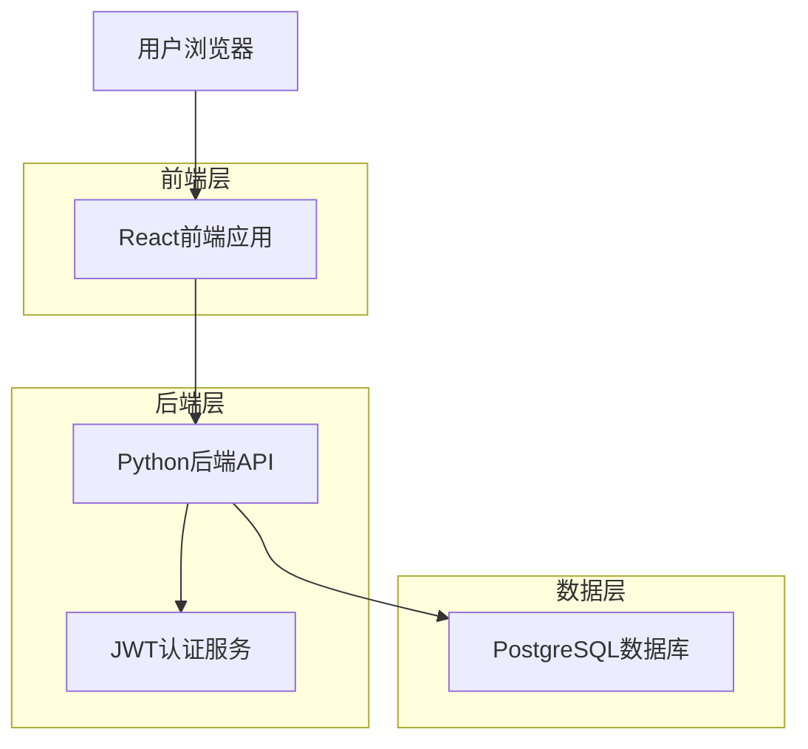
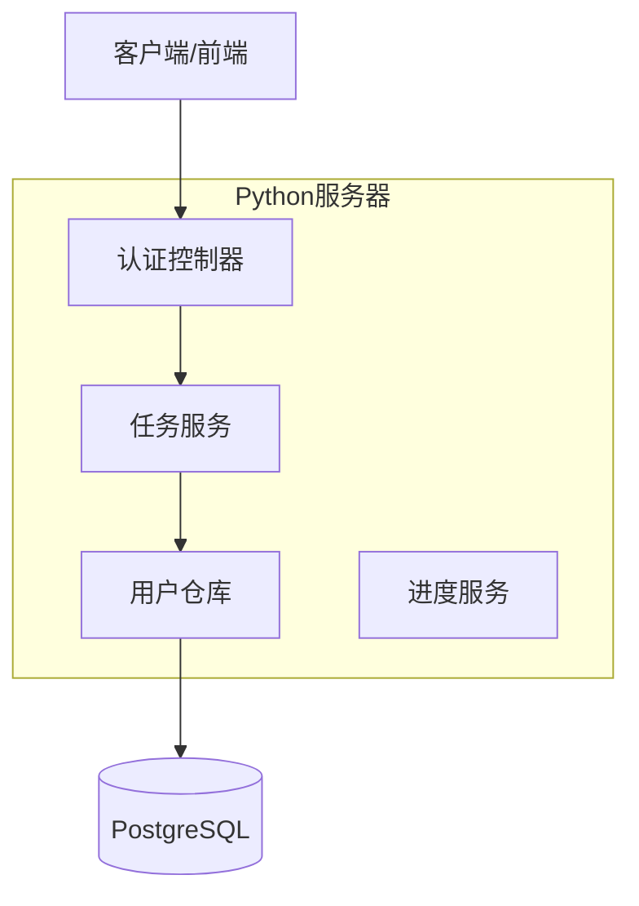
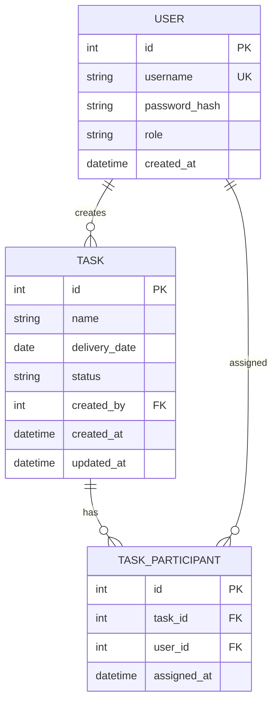

## 1. 架构设计



## 2. 技术描述
- **前端**: React@18 + tailwindcss@3 + vite
- **初始化工具**: vite-init
- **后端**: Python@3.9 + FastAPI@0.104
- **数据库**: PostgreSQL@14
- **认证**: PyJWT@2.8 + bcrypt@4.0

## 3. 路由定义
| 路由 | 用途 |
|-------|---------|
| /login | 登录页面，用户身份验证 |
| /dashboard | 主控制台，任务管理和进度查看入口 |
| /tasks | 任务管理页面，创建和编辑任务 |
| /progress | 进度查看页面，甘特图展示 |
| /api/auth/login | 后端登录接口 |
| /api/tasks | 任务CRUD接口 |
| /api/progress/person | 人员维度进度数据接口 |
| /api/progress/project | 项目维度进度数据接口 |

## 4. API定义

### 4.1 认证相关API
```
POST /api/auth/login
```

请求:
| 参数名 | 参数类型 | 是否必需 | 描述 |
|-----------|-------------|-------------|-------------|
| username | string | true | 用户名 |
| password | string | true | 密码（明文） |

响应:
| 参数名 | 参数类型 | 描述 |
|-----------|-------------|-------------|
| token | string | JWT访问令牌 |
| user | object | 用户信息 |

示例:
```json
{
  "username": "admin",
  "password": "your_password"
}
```

### 4.2 任务管理API
```
GET /api/tasks
POST /api/tasks
PUT /api/tasks/{id}
DELETE /api/tasks/{id}
```

任务对象:
```json
{
  "id": 1,
  "name": "网站重构",
  "delivery_date": "2024-04-15",
  "participants": ["张三", "李四"],
  "status": "进行中",
  "created_at": "2024-03-20T10:00:00Z"
}
```

### 4.3 进度查看API
```
GET /api/progress/person
GET /api/progress/project
```

## 5. 服务器架构图



## 6. 数据模型

### 6.1 数据模型定义


### 6.2 数据定义语言
用户表 (users)
```sql
-- 创建表
CREATE TABLE users (
    id SERIAL PRIMARY KEY,
    username VARCHAR(50) UNIQUE NOT NULL,
    password_hash VARCHAR(255) NOT NULL,
    role VARCHAR(20) DEFAULT 'admin' CHECK (role IN ('admin')),
    created_at TIMESTAMP DEFAULT CURRENT_TIMESTAMP,
    updated_at TIMESTAMP DEFAULT CURRENT_TIMESTAMP
);

-- 创建索引
CREATE INDEX idx_users_username ON users(username);

-- 初始化数据
INSERT INTO users (username, password_hash, role) 
VALUES ('admin', '$2b$12$LQv3c1yqBWVHxkd0LHAkCOYz6TtxMQJqhN8/LewdBPj/RK.PJ..qC', 'admin');
```

任务表 (tasks)
```sql
-- 创建表
CREATE TABLE tasks (
    id SERIAL PRIMARY KEY,
    name VARCHAR(200) NOT NULL,
    delivery_date DATE NOT NULL,
    status VARCHAR(20) DEFAULT '待开始' CHECK (status IN ('待开始', '进行中', '已完成', '已延期')),
    created_by INTEGER REFERENCES users(id),
    created_at TIMESTAMP DEFAULT CURRENT_TIMESTAMP,
    updated_at TIMESTAMP DEFAULT CURRENT_TIMESTAMP
);

-- 创建索引
CREATE INDEX idx_tasks_delivery_date ON tasks(delivery_date);
CREATE INDEX idx_tasks_status ON tasks(status);
CREATE INDEX idx_tasks_created_by ON tasks(created_by);
```

任务参与表 (task_participants)
```sql
-- 创建表
CREATE TABLE task_participants (
    id SERIAL PRIMARY KEY,
    task_id INTEGER REFERENCES tasks(id) ON DELETE CASCADE,
    user_id INTEGER REFERENCES users(id) ON DELETE CASCADE,
    assigned_at TIMESTAMP DEFAULT CURRENT_TIMESTAMP,
    UNIQUE(task_id, user_id)
);

-- 创建索引
CREATE INDEX idx_task_participants_task_id ON task_participants(task_id);
CREATE INDEX idx_task_participants_user_id ON task_participants(user_id);
```